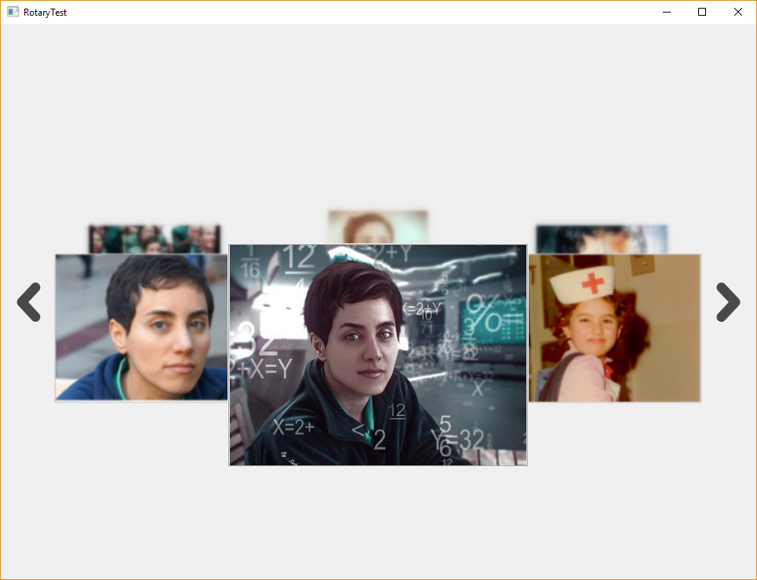

# RoataryCoordinateSystem
RotaryCoordinateSystem is a QWidget container class which can get Qwidget objects and show them in a rotary coordinate system.

You can see a demo in which some photos for Iranian mathematition `Maryam Mirzakhani` are used as desigred widgets

